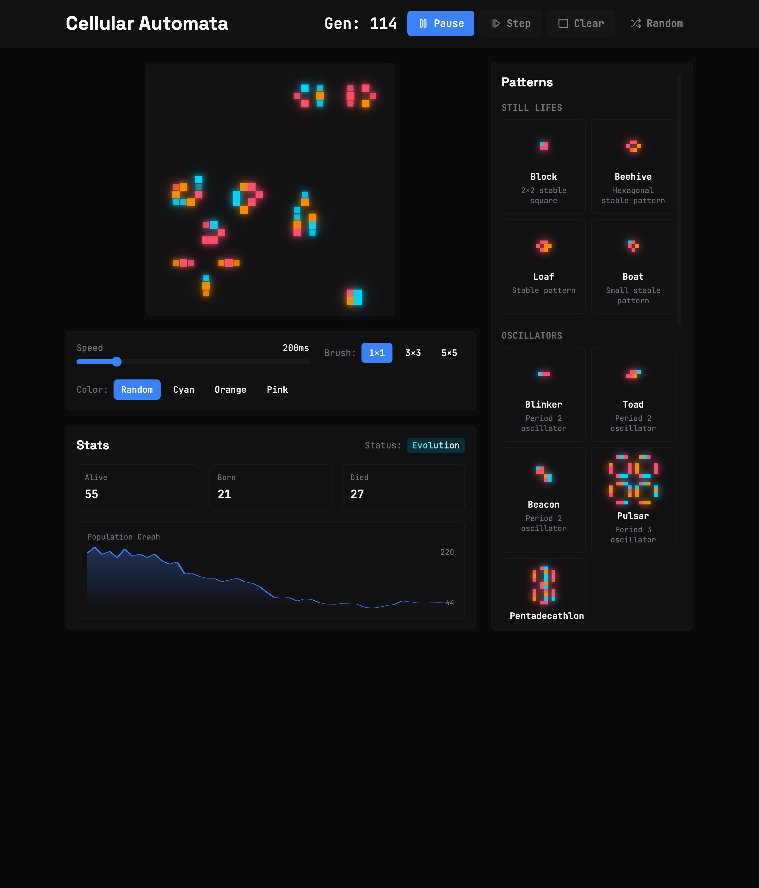

# ✨ Cellular Automata Playground

Interactive visualization of Conway's Game of Life with a modern sci-fi aesthetic, RGB glowing cells, and smooth animations.


## Features

- **Game of Life Simulation** — Classic Conway's rules with interactive controls
- **RGB Glow Effects** — Cells with bloom/glow in three color channels (cyan, orange, pink)
- **Playback Controls** — Play, Pause, Step, Speed slider (50ms–1000ms)
- **Pattern Library** — 15+ preset patterns: Gliders, Spaceships, Oscillators, Guns
- **Manual Editing** — Click, drag, and adjustable brush size (1×1, 3×3, 5×5)
- **Live Statistics** — Generation counter, population graph, births/deaths per step
- **Colony Status** — Dynamic status indicator (Empty, Evolution, Eternal, Dead)
- **Visual Effects** — Shimmer loading states, cursor shine effects
- **Dark Theme** — Sci-fi terminal aesthetic inspired by motion.dev

## Preview



## Tech Stack

| Category | Technology |
|----------|------------|
| Framework | React 18 + TypeScript |
| Build | Vite 5 |
| Styling | Tailwind CSS + CSS Variables |
| Animations | Framer Motion |
| State | Zustand |
| Icons | Lucide React |

## Getting Started

```bash
# Install dependencies
npm install

# Start development server
npm run dev

# Build for production
npm run build

# Preview production build
npm run preview
```

## Project Structure

```
src/
├── components/
│   ├── Grid/          # Game grid and cells with glow effects
│   ├── Controls/      # Playback, speed, brush controls
│   ├── Patterns/      # Pattern library and previews
│   ├── Stats/         # Generation counter, population graph
│   └── UI/            # Reusable UI components
│
├── hooks/
│   ├── useGameOfLife.ts    # Core automaton logic
│   ├── useMousePosition.ts # Cursor tracking for shine effect
│   └── useInterval.ts      # Generation timer
│
├── utils/
│   ├── patterns.ts    # Preset pattern definitions
│   ├── gridHelpers.ts # Grid manipulation utilities
│   └── colors.ts      # Color channel functions
│
└── App.tsx            # Main application component
```

## Patterns

### Still Lifes
Block, Beehive, Loaf, Boat

### Oscillators
Blinker, Toad, Beacon, Pulsar, Pentadecathlon

### Spaceships
Glider, LWSS, MWSS, HWSS

### Guns
Gosper Glider Gun

### Methuselahs
R-pentomino, Diehard, Acorn

## Color Palette

```css
/* Cell Colors */
--cell-cyan:   #00D4FF
--cell-orange: #FF8A00
--cell-pink:   #FF4D6D

/* Background */
--bg-primary:   #0A0A0B
--bg-secondary: #111113
--bg-tertiary:  #1A1A1D

/* Text */
--text-primary: #FAFAFA
--text-muted:   #71717A
```

## Colony Status

| Status | Condition |
|--------|-----------|
| Empty | No alive cells (never had a population) |
| Evolution | Population is changing (births > 0 or deaths > 0) |
| Eternal | Population is stable (births = 0 and deaths = 0, but alive > 0) |
| Dead | Had a population, but all died out |

## References

- [Conway's Game of Life — Wikipedia](https://en.wikipedia.org/wiki/Conway%27s_Game_of_Life)
- [LifeWiki Pattern Catalog](https://conwaylife.com/wiki/)
- [Framer Motion Documentation](https://www.framer.com/motion/)

## License

MIT
